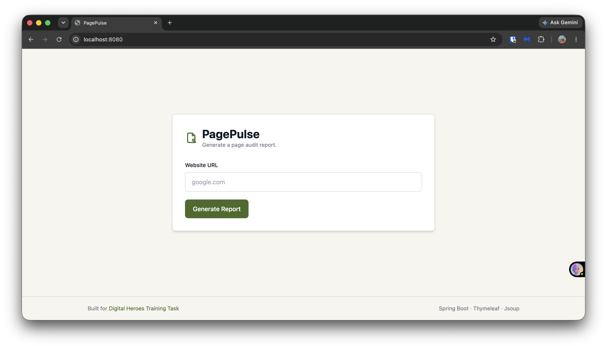
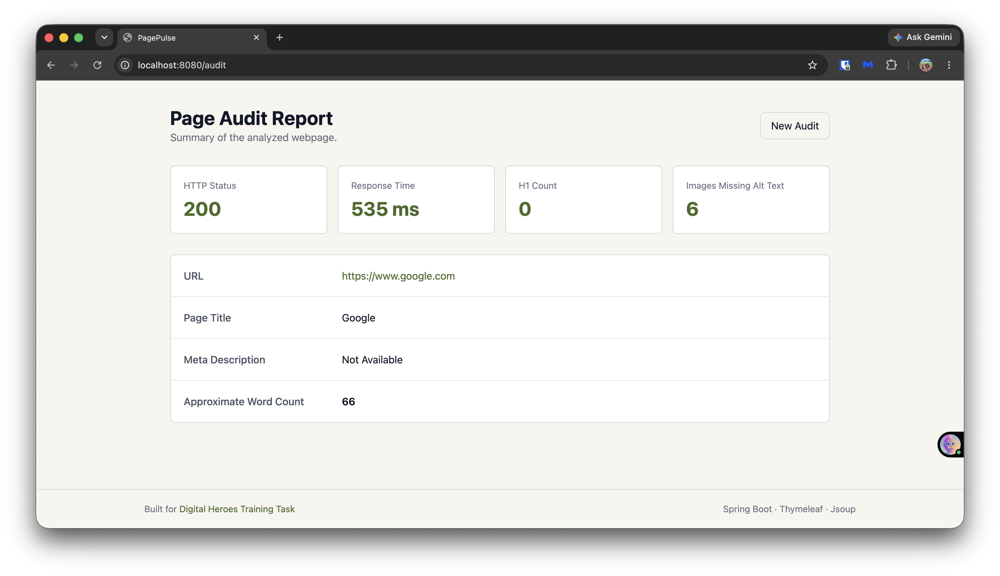
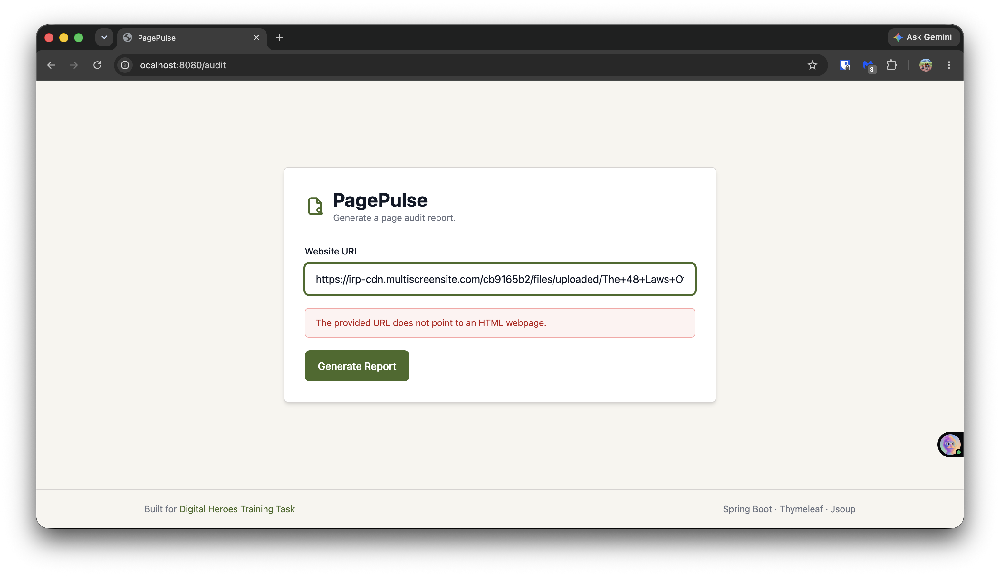

# PagePulse

PagePulse is a web application that accepts a webpage URL, fetches the page, and generates a report containing information such as the HTTP status, response time, page title, meta description, H1 count, images missing alt text, and approximate word count.

The application is built using Spring Boot, Thymeleaf, and Jsoup.

---

## Features

- Audit any publicly accessible webpage
- Display HTTP status code
- Measure response time
- Extract the page title
- Extract the meta description
- Count H1 tags
- Count images without alt attributes
- Calculate approximate word count
- Handle invalid URLs
- Handle non-HTML responses
- Handle request timeouts
- Display meaningful error messages

---

## Technologies Used

- Java 21
- Spring Boot
- Thymeleaf
- Jsoup
- Maven
- JUnit 5

---

## Project Structure

```
src
├── main
│   ├── java
│   │   └── com.pagepulse.pagepulse
│   │       ├── controller
│   │       ├── dto
│   │       ├── exception
│   │       ├── service
│   │       └── PagepulseApplication.java
│   │
│   └── resources
│       ├── static
│       ├── templates
│       └── application.properties
│
└── test
    └── java
        └── com.pagepulse.pagepulse.service
            └── AuditServiceTest.java
```

---

## Getting Started

### Prerequisites

- Java 21 or later
- Maven 3.9 or later
- Internet connection

### Clone the Repository

```bash
git clone https://github.com/RishikeshKarkhanis/pagepulse-digital-heroes-assignment.git
```

### Navigate to the Project

```bash
cd pagepulse-digital-heroes-assignment
```

### Run the Application

Using the Maven Wrapper:

```bash
./mvnw spring-boot:run
```

Or using Maven:

```bash
mvn spring-boot:run
```

Open the application in your browser:

```
http://localhost:8080
```

---

## API

### Endpoint

```
POST /audit
```

### Request

```json
{
  "url": "https://example.com"
}
```

### Response

```json
{
  "url": "https://example.com",
  "httpStatus": 200,
  "responseTime": 184,
  "pageTitle": "Example Domain",
  "metaDescription": "Example description",
  "h1Count": 1,
  "missingAltImages": 0,
  "approximateWordCount": 135
}
```

---

## Error Handling

The application handles the following cases:

- Invalid URL
- Non-HTML responses
- Request timeout
- Server unreachable

---

## Testing

Unit tests were written using JUnit 5.

The current tests cover:

- Successful webpage audit
- Invalid URL
- Non-HTML response

Run the tests using:

```bash
./mvnw test
```

---

## Design Decisions

### 1. Spring Boot with Thymeleaf

I chose Spring Boot with Thymeleaf because the assignment required only a single web application. Using server-side rendering kept the project simple and avoided maintaining separate frontend and backend applications.

### 2. Jsoup

Jsoup was used to fetch webpages and parse HTML. It provides a straightforward way to extract elements such as the page title, meta description, headings, images, and page content.

### 3. Global Exception Handling

Instead of handling exceptions inside controller methods, I used a centralized `GlobalExceptionHandler`. This keeps the controller focused on request handling while ensuring users receive clear error messages for different failure scenarios.

---

## Screenshots

### Home Page



### Audit Report



### Error Handling



---

## Future Improvements

Given additional development time, I would extend the application with the following features:

- Detect broken internal and external links on the webpage.
- Generate an overall audit score with actionable recommendations.
- Export audit reports as PDF files.
- Maintain a local audit history using browser storage, allowing users to revisit recent audit reports without requiring authentication.
- Expand the automated test suite.
- Add support for auditing multiple pages of a website and generating a consolidated report.

---

## AI Usage

AI tools (ChatGPT) were used during the development of this project to discuss specific implementation challenges, such as URL validation, HTML response detection. AI was also used to assist with the user interface design, understand the testing framework used in the project, and refine the project documentation. All generated suggestions were reviewed, adapted where necessary, and validated through manual implementation, testing, and debugging before being incorporated into the final application.

---

## Live Demo

https://<your-render-url>

---

## GitHub Repository

https://github.com/RishikeshKarkhanis/pagepulse-digital-heroes-assignment

---

## Built for Digital Heroes Training Task

https://digitalheroesco.com